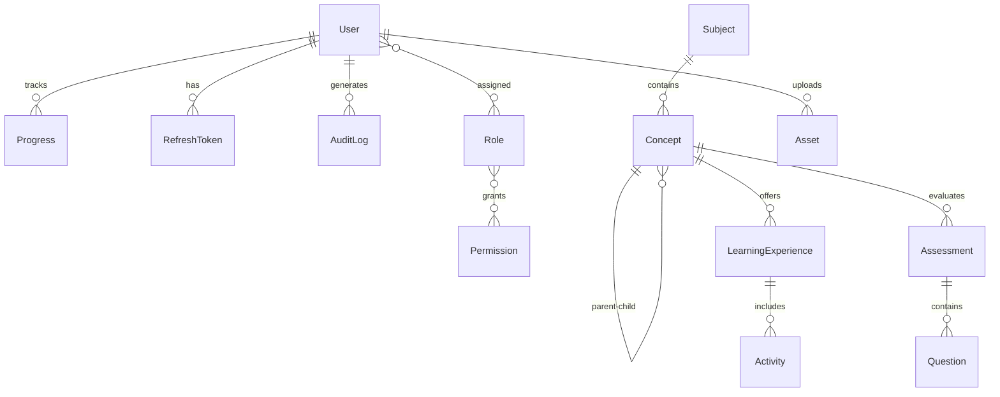

# Viora Backend Architecture

Enterprise-scale Interactive Learning Platform — **Modular Monolith** foundation.

> This document describes the domain-driven architecture scaffold. Business logic is intentionally **not implemented** — services throw `Not implemented` until domain rules are added.

---

## Table of Contents

1. [Architecture Overview](#architecture-overview)
2. [Folder Structure](#folder-structure)
3. [Business Domain Model](#business-domain-model)
4. [Entity Relationships](#entity-relationships)
5. [Module Responsibilities](#module-responsibilities)
6. [Shared Infrastructure](#shared-infrastructure)
7. [DTO Structure](#dto-structure)
8. [Repository Layer](#repository-layer)
9. [Domain Events](#domain-events)
10. [Authorization (RBAC)](#authorization-rbac)
11. [API Versioning & Swagger](#api-versioning--swagger)
12. [Scalability Design Decisions](#scalability-design-decisions)

---

## Architecture Overview

```
┌─────────────────────────────────────────────────────────────────┐
│                        API Gateway Layer                        │
│              /api/v1/*  ·  JWT Auth  ·  RBAC Guards             │
└───────────────────────────────┬─────────────────────────────────┘
                                │
┌───────────────────────────────▼─────────────────────────────────┐
│                     Modular Monolith (NestJS)                     │
│  ┌─────────┐ ┌─────────┐ ┌──────────┐ ┌────────────┐ ┌───────┐ │
│  │  Auth   │ │  Users  │ │ Subjects │ │  Concepts  │ │  ...  │ │
│  └────┬────┘ └────┬────┘ └────┬─────┘ └─────┬──────┘ └───┬───┘ │
│       │           │           │              │            │     │
│       └───────────┴───────────┴──────────────┴────────────┘     │
│                         Domain Services                           │
│       └───────────┬───────────┬──────────────┬────────────┘     │
│                   │           │              │                   │
│              Repositories  Domain Events  Mappers/DTOs            │
└───────────────────────────────┬─────────────────────────────────┘
                                │
                    ┌───────────▼───────────┐
                    │      PostgreSQL         │
                    │   (TypeORM Entities)    │
                    └─────────────────────────┘
```

**Principles:**

| Principle | Implementation |
|-----------|----------------|
| Domain isolation | Each module owns entities, repos, DTOs, events |
| Thin controllers | HTTP only — delegate to services |
| Persistence only in repos | No business rules in repositories |
| Business logic in services | All domain rules live here |
| Extensibility | JSONB config, `rendererKey`, event interfaces |
| Future microservices | Modules can be extracted with minimal coupling |

---

## Folder Structure

```
Viora-BE/
├── src/
│   ├── main.ts                          # Bootstrap, versioning, Swagger
│   ├── app.module.ts                    # Root module wiring
│   │
│   ├── config/
│   │   ├── config.module.ts
│   │   ├── app.config.ts
│   │   ├── database.config.ts
│   │   ├── jwt.config.ts
│   │   └── swagger.config.ts
│   │
│   ├── database/
│   │   ├── database.module.ts
│   │   ├── data-source.ts               # TypeORM CLI migrations
│   │   └── migrations/
│   │
│   ├── common/                          # Cross-cutting infrastructure
│   │   ├── common.module.ts
│   │   ├── entities/
│   │   │   └── base.entity.ts
│   │   ├── repositories/
│   │   │   └── base.repository.ts
│   │   ├── dto/
│   │   │   ├── api-response.dto.ts
│   │   │   ├── pagination-query.dto.ts
│   │   │   ├── pagination-meta.dto.ts
│   │   │   └── search-query.dto.ts
│   │   ├── enums/
│   │   ├── filters/
│   │   ├── pipes/
│   │   ├── decorators/
│   │   ├── interfaces/                  # CacheService, StorageService
│   │   ├── events/                      # DomainEvent base interface
│   │   ├── helpers/
│   │   └── logger/
│   │
│   └── modules/
│       ├── auth/
│       ├── users/
│       ├── subjects/
│       ├── concepts/
│       ├── experiences/
│       ├── activities/
│       ├── assessments/
│       ├── progress/
│       ├── assets/
│       ├── analytics/
│       └── search/
│
├── package.json
├── tsconfig.json
├── nest-cli.json
└── .env.example
```

### Per-Module Structure (consistent across all domains)

```
modules/{domain}/
├── {domain}.module.ts
├── controllers/
├── services/
├── repositories/
├── entities/
├── dto/
├── mappers/
├── validators/          # Guards, custom validators
├── interfaces/          # Repository contracts
├── enums/
├── constants/
├── events/              # Domain event interfaces
└── tests/
```

---

## Business Domain Model

```
Subject
  └── Concept (recursive tree — no separate Chapter/Subchapter tables)
        ├── Concept (child)
        │     └── Concept (grandchild) ...
        │
        ├── LearningExperience
        │     ├── type: simulation | timeline | game | quiz | ...
        │     ├── rendererKey: "gravity_simulator" (frontend maps this)
        │     ├── configuration: JSONB
        │     └── Activity
        │           ├── type: mcq | drag_drop | experiment | ...
        │           └── configuration: JSONB
        │
        └── Assessment
              └── Question
                    ├── type: mcq | true_false | essay | simulation | ...
                    └── content: JSONB

User ──► Progress (tracks experience, activity, assessment state)
User ──► Role ──► Permission (RBAC)
Asset (metadata only — files in cloud storage later)
```

---

## Entity Relationships



### Base Entity (all entities inherit)

| Field | Type | Purpose |
|-------|------|---------|
| `id` | UUID | Primary key |
| `createdAt` | timestamptz | Audit |
| `updatedAt` | timestamptz | Audit |
| `createdBy` | UUID | Actor tracking |
| `updatedBy` | UUID | Actor tracking |
| `deletedAt` | timestamptz | Soft delete |
| `version` | int | Optimistic locking |
| `status` | enum | Entity lifecycle (draft, published, archived) |

### Key Indexes

- **Concept**: `subjectId`, `parentId`, `(slug, subjectId)` unique, materialized path tree
- **LearningExperience**: `conceptId`, `type`, `rendererKey`, `(conceptId, order)`
- **Progress**: `(userId, learningExperienceId)` unique partial index
- **Asset**: `storageKey` unique, `type`, `mimeType`

---

## Module Responsibilities

### `auth`
**Why:** Centralizes identity, JWT tokens, refresh token rotation, RBAC primitives, and audit logging.

- Entities: `Role`, `Permission`, `RefreshToken`, `AuditLog`
- JWT strategy, guards (`JwtAuthGuard`, `RolesGuard`)
- Roles: Super Admin, Admin, Teacher, Content Creator, Student

### `users`
**Why:** Manages learner and staff profiles separately from authentication mechanics.

- Entity: `User`
- Profile CRUD, role assignment (via service layer)
- Publishes: `UserCreated`, `UserUpdated`, `UserDeleted`

### `subjects`
**Why:** Top-level curriculum domains (Physics, History, Mathematics). Entry point for content navigation.

- Entity: `Subject`
- Slug-based routing, ordering, publish workflow

### `concepts`
**Why:** Core recursive knowledge graph. Replaces rigid Chapter/Subchapter tables with an infinitely nestable tree.

- Entity: `Concept` (TypeORM materialized-path tree)
- Tree queries, move/reparent, publish events
- Publishes: `ConceptPublished`, `ConceptMoved`

### `experiences`
**Why:** Learning Experiences are polymorphic interactive units — simulations, timelines, games, videos. Backend stores **type + rendererKey + JSONB config**; frontend resolves React components.

- Entity: `LearningExperience`
- `rendererKey` examples: `gravity_simulator`, `history_timeline`, `grammar_game`
- Never stores React component references

### `activities`
**Why:** Granular tasks within an experience (MCQ challenge, drag-drop, experiment step). Enables partial progress and scoring at task level.

- Entity: `Activity`
- JSONB configuration per activity type
- Publishes: `TaskCompleted`

### `assessments`
**Why:** Formal evaluation attached to concepts. Separated from experiences to support standalone tests and mixed question types.

- Entities: `Assessment`, `Question`
- Question types: MCQ, TrueFalse, ShortAnswer, Essay, Interactive, Simulation, DragDrop
- Publishes: `AssessmentFinished`

### `progress`
**Why:** Tracks learner state across the entire hierarchy — current position, scores, attempts, simulation state, bookmarks.

- Entity: `Progress`
- JSONB fields: `simulationState`, `bookmark`, `lastPosition`, `completedActivities`
- Publishes: `ProgressUpdated`

### `assets`
**Why:** Decouples media metadata from content entities. Files live in cloud storage; DB stores references only.

- Entity: `Asset`
- Types: Image, Video, 3D Model, Audio, SVG, Document
- `StorageService` interface for S3/GCS integration later

### `analytics`
**Why:** Consumes domain events to build dashboards without polluting core domains. Can evolve to a separate read model / data warehouse.

- No owned entities (event-driven read side)
- Aggregates from Progress, Activity, Assessment events

### `search`
**Why:** Cross-domain discovery. `SearchProvider` interface allows swapping PostgreSQL full-text → Elasticsearch/OpenSearch without restructuring modules.

- `SearchProvider` interface (not implemented)
- Indexes: subjects, concepts, experiences, activities, assessments

---

## Shared Infrastructure

| Component | Location | Purpose |
|-----------|----------|---------|
| `BaseEntity` | `common/entities/` | UUID, audit, soft delete, versioning |
| `BaseRepository` | `common/repositories/` | Pagination helpers, CRUD primitives |
| `ApiResponseDto` | `common/dto/` | Uniform API envelope |
| `PaginatedResponseDto` | `common/dto/` | page, limit, sort, search, filters |
| `GlobalExceptionFilter` | `common/filters/` | Consistent error responses |
| `CustomValidationPipe` | `common/pipes/` | class-validator + whitelist |
| `CurrentUser` decorator | `common/decorators/` | JWT payload injection |
| `TransactionHelper` | `common/helpers/` | Unit-of-work transactions |
| `CacheService` | `common/interfaces/` | Redis adapter (future) |
| `StorageService` | `common/interfaces/` | S3/GCS adapter (future) |
| `DomainEvent` | `common/events/` | Event bus contract (future) |

---

## DTO Structure

Every domain module follows the same DTO pattern:

| DTO | Purpose |
|-----|---------|
| `Create*Dto` | Input validation for creation |
| `Update*Dto` | Partial updates (`PartialType`) |
| `*ResponseDto` | API output shape (via mappers) |
| `*QueryDto` | Extends `PaginationQueryDto` with domain filters |

### Pagination (reusable)

```typescript
PaginationQueryDto {
  page?: number;      // default 1
  limit?: number;     // default 20, max 100
  sortBy?: string;
  sortOrder?: ASC | DESC;
  search?: string;
}
```

---

## Repository Layer

- **Interface** in `interfaces/` — defines persistence contract
- **Implementation** in `repositories/` — extends `BaseRepository<T>`
- **Symbol tokens** for DI (e.g., `USER_REPOSITORY`)
- Repositories handle: queries, pagination, soft delete
- Repositories do **not** handle: business rules, event publishing, authorization

---

## Domain Events

Event **interfaces only** — no bus implementation yet. Each module defines typed events:

| Module | Events |
|--------|--------|
| concepts | `ConceptPublished`, `ConceptMoved` |
| experiences | `ExperienceCreated` |
| activities | `TaskCompleted` |
| assessments | `AssessmentFinished` |
| progress | `ProgressUpdated` |
| assets | `AssetUploaded` |

Future: wire to NestJS EventEmitter, RabbitMQ, or Kafka without changing event contracts.

---

## Authorization (RBAC)

```
User ──M:N──► Role ──M:N──► Permission
                │
                ├── super_admin
                ├── admin
                ├── teacher
                ├── content_creator
                └── student
```

- `@Roles(RoleSlug.TEACHER)` decorator
- `@RequirePermissions('concept:publish')` decorator
- `@Public()` for unauthenticated routes
- `JwtAuthGuard` + `RolesGuard` applied globally (configure in app bootstrap)

---

## API Versioning & Swagger

- **Prefix:** `/api`
- **Version:** URI-based → `/api/v1/subjects`
- **Swagger:** `/api/docs`
- Bearer JWT auth configured in Swagger UI

Configured in `main.ts`:

```typescript
app.setGlobalPrefix('api');
app.enableVersioning({ type: VersioningType.URI, defaultVersion: '1' });
SwaggerModule.setup('api/docs', app, document);
```

---

## Scalability Design Decisions

| Decision | Rationale |
|----------|-----------|
| JSONB for config | New experience/activity types without schema migrations |
| `rendererKey` indirection | Backend agnostic to frontend framework |
| Recursive Concept tree | Unlimited depth vs fixed Chapter/Subchapter |
| Materialized path (Concept) | Efficient subtree queries at scale |
| Soft delete everywhere | Audit trail, recovery, referential safety |
| Optimistic locking (`version`) | Concurrent content editing |
| Partial unique indexes on Progress | One active record per user+resource |
| Module-per-domain | Extract to microservice when traffic demands |
| SearchProvider abstraction | Add Elasticsearch without domain changes |
| Domain events | Async analytics, AI features, notifications |
| Asset metadata separation | CDN/cloud storage scaling independent of DB |

### Growth Path

1. **Phase 1 (now):** Modular monolith, PostgreSQL, JSONB configs
2. **Phase 2:** Redis cache, S3 storage, event bus
3. **Phase 3:** Elasticsearch via Search module, read replicas
4. **Phase 4:** Extract high-traffic modules (progress, analytics) to services

---

## Getting Started

```bash
cp .env.example .env
npm install
npm run migration:run    # after generating migrations
npm run start:dev
# Swagger: http://localhost:3000/api/docs
```

---

## Entity File Reference

| Entity | Module | Table |
|--------|--------|-------|
| User | users | `users` |
| Role | auth | `roles` |
| Permission | auth | `permissions` |
| RefreshToken | auth | `refresh_tokens` |
| AuditLog | auth | `audit_logs` |
| Subject | subjects | `subjects` |
| Concept | concepts | `concepts` |
| LearningExperience | experiences | `learning_experiences` |
| Activity | activities | `activities` |
| Assessment | assessments | `assessments` |
| Question | assessments | `questions` |
| Progress | progress | `progress` |
| Asset | assets | `assets` |

Junction tables: `user_roles`, `role_permissions`
